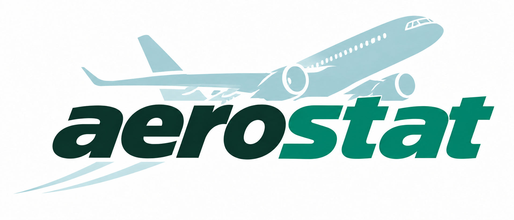

<div align="center">



# AeroStat: Real-Time Airfare Price Index for India
### High-Frequency Automated Web Scraping & Econometric Intelligence for CPI Augmentation

[](https://www.sih.gov.in/)
[](https://www.sih.gov.in/)
[]()
[]()
[]()
[]()
[](https://aerostat-sih26.onrender.com)

**A production-grade, transparent, and resilient airfare intelligence observatory designed to augment the official Consumer Price Index (CPI) with high-frequency, advance-purchase-adjusted price signals.**

### 🌐 [Click Here to View Live Prototype on Render](https://aerostat-sih26.onrender.com)

[🌐 Live Demo](https://aerostat-sih26.onrender.com) • [⚡ Quick Start](#-quick-start-for-evaluators) • [💡 Problem & Solution](#-problem-statement--core-solution) • [📐 Econometric Methodology](#-econometric-methodology--jevons-formulation) • [🏗 Architecture](#-system-architecture) • [✨ Key Features](#-key-features--prototype-walkthrough) • [🛡 Challenges & Mitigations](#-challenges--engineering-mitigations) • [📚 Standards & References](#-academic--official-standards-compliance)

---

</div>

## 📌 Executive Summary

India's civil aviation market is among the fastest growing in the world, characterized by aggressive dynamic pricing, seasonal surges, and complex ancillary unbundling. However, the official Consumer Price Index (CPI) compiled by the **Ministry of Statistics and Programme Implementation (MoSPI)** currently tracks airfares through periodic monthly surveys, leaving a **30 to 45-day lag** between real-world fare shocks and published statistics.

**AeroStat** solves this by establishing an automated, multi-source data pipeline that captures daily airfare quotes across domestic trunk routes and 5 standardized booking horizons ($T+1, T+7, T+15, T+30, T+45$). By enforcing a rigorous, standardized consumer fare definition and applying an axiomatic **Jevons Price Index** aggregated with **DGCA/MoSPI passenger traffic weights**, AeroStat delivers timely, auditable, and bias-free airfare indices for national policy and inflation nowcasting.

---

## ⚡ Quick Start for Evaluators

The prototype is accessible both as a **live cloud deployment** and as an **instant zero-friction local installation**.

### 🌟 Option 1: Live Cloud Deployment (Instant Evaluation)
Evaluators can test the fully interactive platform directly in the browser:
👉 **[https://aerostat-sih26.onrender.com](https://aerostat-sih26.onrender.com)**

*✨ Hosted on Render's global Edge CDN — zero installation or setup required. Loads complete route datasets, horizon curves, Jevons index calculations, and audit tools.*

---

### Option 2: Run Locally with Node.js
1. Ensure **Node.js** (v18+) is installed.
2. In the repository root directory, run:
   ```bash
   npm start
   ```
3. Open your browser and navigate to:
   ```
   http://127.0.0.1:4173
   ```

### Option 3: Run Locally with Python HTTP Server
```bash
python -m http.server 4173 --bind 127.0.0.1 --directory dist
```

### Option 4: Run the Collection Service & REST API (Backend)
```bash
cd backend
python server.py
```
*Runs the SQLite-backed collection daemon, REST endpoints (`/status`, `/observations`, `/schedule`, `/run`), and automated task scheduler.*

---

## 🎯 Problem Statement & Core Solution

### The Challenge (SIH26056)
> *"Development of a Real-time Airfare Price Index for India through Automated Web Scraping of Airline and Online Travel Aggregator Portals for Augmentation of the Consumer Price Index (CPI)."*

### Current System (Official CPI) vs. AeroStat (Proposed)

| Dimension | Current Official CPI (Base 2024 / 2012) | AeroStat Real-Time Platform |
| :--- | :--- | :--- |
| **Observation Frequency** | 1 single retrospective quote per month | **Daily continuous tracking** across all routes |
| **Lead Time Awareness** | Blended single departure date; ignores dynamic pricing | **5 Distinct Horizons:** $T+1, T+7, T+15, T+30, T+45$ |
| **Price Concept** | Susceptible to inconsistent fee quotes | **Uniform Consumer Fare:** Base + Fuel + UDF + Taxes |
| **Data Sources** | Limited manual sampling or delayed reports | **Multi-source:** Airlines (IndiGo, Air India, SpiceJet, Akasa) + OTAs (MMT, EaseMyTrip, Yatra) |
| **Policy Latency** | 30–45 days publication lag | **Real-time / T+24h** early-warning inflation signals |
| **Auditability** | Aggregate tables published without granular audit trails | **Full microdata provenance:** Every fare timestamped & verifiable |

---

## 📐 Econometric Methodology & Jevons Formulation

To satisfy international statistical standards (IMF/ILO/World Bank/OECD CPI Manual 2020 and UK ONS Airfares Methodology 2026), AeroStat implements an axiomatic **Jevons Elementary Price Index** combined with **Passenger Traffic Volume Weighting**.

### 1. The Standardized Consumer Fare Definition
Airfares suffer from "drip pricing" and unbundled extras. AeroStat enforces a strict definition:
* **Product:** 1 adult, one-way, non-stop, economy class.
* **Included (Mandatory):** Base fare + Fuel surcharge (YQ/YR) + User Development Fee (UDF) + Passenger Service Fee (PSF) + Goods and Services Tax (GST) + mandatory checkout convenience charges.
* **Excluded (Optional):** Seat selection fees, checked baggage add-ons above allowance, priority boarding, in-flight meals, travel insurance.

### 2. Item-Level Price Relative
For each matched flight offer $j$ on route $r$ and advance booking horizon $h$, the price relative between current observation period $t$ and base period $0$ is:
$$r_{j,t} = \frac{P_{j,t}}{P_{j,0}}$$

### 3. Route-Horizon Elementary Index (Jevons Formula)
Within each route $r$ and booking horizon $h$, the elementary index is computed as the **unweighted geometric mean of price relatives**:
$$I_{r,h} = 100 \times \left( \prod_{j=1}^{n_{r,h}} \frac{P_{j,t}}{P_{j,0}} \right)^{\frac{1}{n_{r,h}}} = 100 \times \exp\left( \frac{1}{n_{r,h}} \sum_{j=1}^{n_{r,h}} \ln\left( \frac{P_{j,t}}{P_{j,0}} \right) \right)$$

---

#### ⚖️ Methodological Comparison: Why Dutot & Carli are Unreliable for Airfares

In official price statistics, three elementary formulas are traditionally considered: **Jevons** (Geometric mean), **Dutot** (Ratio of arithmetic means), and **Carli** (Arithmetic mean of price relatives).

##### 1. The Critical Flaw of the Dutot Formula in Civil Aviation:
The Dutot index is defined as the ratio of arithmetic average prices:
$$I_{\text{Dutot}} = \frac{\frac{1}{n}\sum_{i=1}^n P_{i,t}}{\frac{1}{n}\sum_{i=1}^n P_{i,0}} = \frac{\sum P_{i,t}}{\sum P_{i,0}}$$

Mathematically, this can be rewritten as a **weighted sum of price relatives**:
$$I_{\text{Dutot}} = \sum_{i=1}^n \left( \frac{P_{i,0}}{\sum_{k=1}^n P_{k,0}} \right) \cdot \left( \frac{P_{i,t}}{P_{i,0}} \right)$$

Notice the implicit weight: **$\frac{P_{i,0}}{\sum P_{k,0}}$**. This leads to three severe distortions when applied to modern dynamic airline pricing:
* **Implicit Price-Level Distortion:** Dutot implicitly gives more weight to higher-priced tickets. A prime morning business flight priced at ₹12,000 carries **three times the weight** of a low-cost carrier ticket priced at ₹4,000, even if 80% of passengers flew on the budget airline!
* **Commensurability Failure:** International standards (*IMF CPI Manual 2020*) warn that Dutot is only valid when products are strictly homogeneous in quality and physical units. In air travel, flights differ drastically in departure slots, baggage allowances, and refundability.
* **Sensitivity to Price Bouncing & Dynamic Outliers:** If an expensive ₹15,000 ticket rises by just 4% (+₹600), while four ₹3,500 tickets drop by 15% (-₹525 each = -₹2,100 consumer savings), Dutot will disproportionately skew toward the expensive flight and overstate inflation.

##### 2. The Flaw of the Carli Formula:
The Carli formula ($I_{\text{Carli}} = \frac{1}{n}\sum \frac{P_t}{P_0}$) fails the **Time Reversal Test** ($I_{0,t} \times I_{t,0} > 1$) due to Jensen's inequality (the AM-GM inequality), causing systematic **upward inflation drift** when prices fluctuate.

##### 3. Why Jevons is the Gold Standard:
* **Scale Invariant:** A 10% price change on a ₹4,000 flight and a 10% price change on a ₹10,000 flight receive equal proportional importance.
* **Axiomatically Sound:** Strictly satisfies both the **Time Reversal Test** ($I_{0,t} \times I_{t,0} = 1$) and the **Circular/Transitivity Test**.
* **Endorsed by Global Authorities:** Recommended by the **IMF, ILO, World Bank, OECD**, and the **UK ONS (2026)** for dynamic scanner and web-scraped data.

---

#### 🔌 Pluggable Architecture Guarantee (Seamless MoSPI Integration)
> **"What if MoSPI / NSO mandates the Dutot or Carli formula for institutional continuity?"**
> 
> While **Jevons is our scientifically recommended default**, AeroStat is built with a **modular, pluggable index engine**. If MoSPI statistical guidelines require the **Dutot method** (or Carli) to align with existing legacy CPI compilation modules, our backend can switch formulas instantly:
> * **Via Configuration:** Set `INDEX_FORMULA="dutot"` in environment settings.
> * **Via API Parameter:** Request `GET /indices?formula=dutot` to calculate the Dutot index on the fly.
> * **No Pipeline Re-engineering Required:** Raw observation records remain identical; only the elementary aggregation mathematical kernel is swapped.

### 4. National Horizon Index Aggregation
National indices for each horizon are constructed using official route expenditure/traffic weights $w_r$ derived from **DGCA City-Pair Traffic Statistics (Table 5.01)**:
$$I_{\text{national},h} = \sum_{r \in \text{Routes}} w_r \cdot I_{r,h} \quad \text{where } \sum_{r} w_r = 1.0$$

### 5. Numerical Worked Example (As Demonstrated in Prototype)
Consider two matched fare items on `DEL-BOM`:
* **Item A:** Base = ₹5,000 $\rightarrow$ Current = ₹5,500 ($r_A = 1.10$, +10%)
* **Item B:** Base = ₹4,000 $\rightarrow$ Current = ₹3,600 ($r_B = 0.90$, -10%)

$$\text{Jevons Index} = 100 \times \sqrt{1.10 \times 0.90} = 100 \times \sqrt{0.99} \approx \mathbf{99.50}$$
*Result: Even though one fare rose by 10% and one dropped by 10%, the basket reflects an overall 0.50% decline, demonstrating the protective nature of geometric aggregation against upward skew.*

---

## 🏗 System Architecture

The following diagram illustrates AeroStat's end-to-end data processing and validation lifecycle:

```mermaid
flowchart TD
    subgraph Sources ["1. Multi-Portal Fare Ingestion"]
        A1["Airlines: IndiGo, Air India, SpiceJet, Akasa"]
        A2["OTAs: MakeMyTrip, EaseMyTrip, Yatra, Cleartrip"]
    end

    subgraph Collection ["2. Headless Collection & Scheduling"]
        B1["Python Playwright Async Engine"]
        B2["Cron Scheduler (Daily @ 06:00 IST)"]
        B3["Polite Harvester: Rate Limiting & Exponential Backoff"]
    end

    subgraph Normalization ["3. Data Cleaning & Normalization"]
        C1["Standardized Fare Extractor: Base + Taxes + UDF"]
        C2["Deduplication Engine (Cross-OTA & Carrier Matching)"]
        C3["Missing / Sold-Out Price Imputation Filter"]
    end

    subgraph Storage ["4. Auditable Storage Layer"]
        D1["PostgreSQL / SQLite Database"]
        D2["Full Provenance: Route, Flight, Horizon, Timestamp"]
    end

    subgraph Engine ["5. Econometric Calculation Engine"]
        E1["Jevons Elementary Aggregator (Pandas / NumPy)"]
        E2["DGCA / MoSPI Route Weight Matrix (wr)"]
        E3["5 Distinct Horizon Indices (T+1, T+7, T+15, T+30, T+45)"]
    end

    subgraph Delivery ["6. Policy Consumption & Interactive UI"]
        F1["FastAPI REST Endpoints (/status, /observations, /indices)"]
        F2["Interactive Airfare Observatory Dashboard"]
        F3["MoSPI / RBI Inflation Surveillance & CSV/JSON Export"]
    end

    Sources --> Collection
    Collection --> Normalization
    Normalization --> Storage
    Storage --> Engine
    Engine --> Delivery
```



---

## 🛫 Monitored Basket & Booking Horizons

### The 5 Standardized Advance-Purchase Horizons
Airline tickets are perishable commodities subject to dynamic yield management algorithms. Tracking a single departure date fails to represent the true consumer experience. AeroStat samples across 5 strategic horizons:

| Horizon | Typical Booking Persona | Price Sensitivity | Volatility Level |
| :---: | :--- | :--- | :---: |
| **$T+1$** | Emergency, immediate business, bereavement | Low price sensitivity (Inelastic) | **Extremely High** |
| **$T+7$** | Short-notice corporate trips, urgent personal travel | Moderate price sensitivity | **High** |
| **$T+15$** | Planned short-haul travel, domestic business meetings | Balanced elasticity | **Medium** |
| **$T+30$** | Standard vacationers, festival trips, cost-aware travellers | High price sensitivity (Elastic) | **Low–Moderate** |
| **$T+45$** | Early holiday planners, group travel, budget leisure | Very high price sensitivity | **Baseline / Stable** |

### The Core High-Density Route Basket
Based on **DGCA Passenger Traffic Table 5.01**, the prototype tracks India's highest-volume domestic trunk routes:

| Route Code | City Pair | DGCA Traffic Share (Weight $w_r$) | Typical Base Fare (₹) | Key Operating Carriers |
| :---: | :--- | :---: | :---: | :--- |
| **DEL-BOM** | Delhi $\leftrightarrow$ Mumbai | **24.0%** | ₹4,800 | IndiGo, Air India, Akasa, SpiceJet |
| **DEL-BLR** | Delhi $\leftrightarrow$ Bengaluru | **19.0%** | ₹5,200 | IndiGo, Air India, Akasa |
| **BLR-BOM** | Bengaluru $\leftrightarrow$ Mumbai | **16.0%** | ₹3,400 | IndiGo, Air India, Akasa |
| **DEL-CCU** | Delhi $\leftrightarrow$ Kolkata | **15.0%** | ₹4,600 | IndiGo, Air India, SpiceJet |
| **BOM-HYD** | Mumbai $\leftrightarrow$ Hyderabad | **13.0%** | ₹3,100 | IndiGo, Air India |
| **DEL-MAA** | Delhi $\leftrightarrow$ Chennai | **13.0%** | ₹4,900 | IndiGo, Air India |

---

## ✨ Key Features & Prototype Walkthrough

AeroStat's interface is structured into dedicated operational workspaces:

### 1. Overview & Live Market Observatory
* **Real-time KPI Tiles:** Displays National Airfare Index, lowest observed fare, route-specific Jevons index, and observation coverage count.
* **Lead-Time Price Curve:** Visualizes fare decay from $T+1$ down to $T+45$, highlighting the spread between Average, Lowest, and Base fares.
* **National Horizon Index Bar Chart:** Quick comparison of inflation across all 5 booking windows relative to Base = 100.
* **Micro-Data Inspection Table:** Tabular listing of individual airline flights, prices with tax breakdowns, calculated price relatives ($r_j$), and validation badges.

### 2. Route Explorer & Weight Configuration
* Interactive cards for all 6 core domestic city-pairs.
* Breakdown of route weights, base price thresholds, and daily observation counts.

### 3. Collection Automation & Scheduler
* **Scheduled Runs:** Automated daily runs scheduled at 06:00 IST.
* **Service Connection Panel:** Connects local or cloud-hosted collector microservices over HTTPS with token authentication.
* **Execution Audit Log:** Full table of collection runs, execution status, elapsed times, and captured fare counts.

### 4. Interactive Econometric Calculator
* Step-by-step mathematical breakdown of the Jevons formula.
* Built-in worked example proving anti-bias properties against volatile airline pricing.

### 5. Research & Policy Export
* Instant one-click CSV export of clean, validated microdata containing:
  `observation_id, route, horizon, airline, flight_number, source, base_fare, taxes, total_fare, observed_at, price_relative`

---

## 🛡 Challenges & Engineering Mitigations

A robust hackathon prototype must anticipate production hazards. AeroStat incorporates concrete engineering mitigations:

| # | Challenge / Operational Risk | Real-World Impact | AeroStat Technical Mitigation |
| :---: | :--- | :--- | :--- |
| **1** | **Anti-Bot Defenses & IP Throttling** | Scrapers blocked by Cloudflare, Akamai, or rate-limits | Headless Playwright engine with randomized user agents, human-like scroll jitter, conservative rate limiting, and modular adapter interfaces for official GDS/API access. |
| **2** | **Drip Pricing & Unbundled Fees** | Airlines display misleading base fares; taxes added at checkout | Strict parsing logic extracts mandatory taxes, UDF, and fees at the checkout summary stage; explicitly ignores optional add-ons (meals, seats, insurance). |
| **3** | **Duplicate Listings Across OTAs** | Aggregators list the same physical flight at differing markups | Strict deduplication key: `(Carrier, FlightNumber, DepartureDate, Cabin)`. Computes clean carrier-direct vs. OTA averages without double-counting flight capacity. |
| **4** | **Sold-Out Flights & Missing Fares** | Last-minute flights ($T+1$) sell out, creating missing values | Imputation follows international CPI rules: logs missing status and applies route-wide geometric price movement rather than naive zero-filling. |
| **5** | **Weighting Discrepancies** | Lack of real-time passenger manifests | Fallback to **DGCA Table 5.01 City-Pair Statistics** as an empirical, transparent proxy until MoSPI provides internal PSD basket shares. |

---

## 📚 Academic & Official Standards Compliance

AeroStat's mathematical and methodological foundation is directly aligned with premier domestic and international statistical frameworks:

1. **MoSPI / NSO (Base 2024 & Expert Group Report Jan 2026):**
   * Incorporates modernization guidelines for electronic price collection and high-frequency CPI basket augmentation.
2. **DGCA City-Pair Passenger Traffic (Table 5.01, 2024-25):**
   * Provides authoritative domestic air traffic volume weighting ($w_r$) across Indian airports.
3. **UK Office for National Statistics (ONS) Air Fares Methodology (March 2026):**
   * Adopts the international best practice of segmenting airfares into separate advance-booking horizon indices ($T+1$ to $T+45$).
4. **Ottawa Group on Price Indices (Istat, 2022):**
   * Implements principles on *“Web Scraping and API-based Scanner Data for High-Frequency Price Statistics”*.
5. **Consumer Price Index Manual: Concepts and Methods (IMF, ILO, OECD, Eurostat, UN, World Bank, 2020):**
   * Enforces the Jevons elementary index to eliminate Carli upward bias in volatile multi-source price environments.

---

## 💻 Technical Stack

```
Frontend Architecture:
├── HTML5 / Modern Semantic Web Layout
├── Custom Responsive CSS Design System (Glassmorphic dark/light UI)
├── Vanilla ES6+ Modular JavaScript (Zero external JS runtime dependencies)
└── Embedded SVG Micro-charts & Lead-time Curves

Backend & Collection Service:
├── Python 3.11+ / Playwright (Headless browser automation)
├── FastAPI / Python http.server REST Endpoints
├── SQLite (Local Zero-Config Prototyping) & PostgreSQL (Production Scalability)
├── Pandas & NumPy (Vectorized Jevons Price Aggregation Engine)
└── Docker & Pytest (Containerization and unit testing)
```

---

## 👥 Team & Submission Information

* **Competition:** Smart India Hackathon (SIH) 2026
* **Problem Statement ID:** `SIH26056`
* **Problem Statement Title:** Development of a Real-time Airfare Price Index for India through Automated Web Scraping of Airline and Online Travel Aggregator Portals for Augmentation of the Consumer Price Index (CPI)
* **Theme:** Smart Automation
* **Category:** Software
* **Team ID:** `183555`
* **Team Name:** `OMEGA8`

---

<div align="center">

**AeroStat — Smarter Data. Better Airfare Insights.**  
*Empowering MoSPI, RBI, and Indian consumers with real-time price transparency.*

</div>
